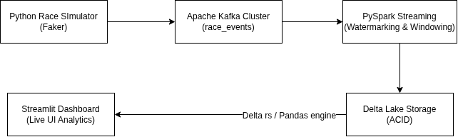

# 🏃 Real-Time 10k Race Tracking Pipeline

An end-to-end real-time data engineering project that simulates 1,000 runners crossing timing checkpoints during a 1,000-meter race, streams data through **Apache Kafka**, processes streaming aggregations and stateful watermarking with **PySpark Structured Streaming**, persists data into a **Delta Lake** storage layer, and visualizes live race analytics via a **Streamlit** web dashboard.

---

## 📐 System Architecture


---

## 🛠 Tech Stack

| Technology | Role in Architecture |
| :--- | :--- |
| **Python 3.11 / 3.12** | Core programming language for simulation and consumer processing. |
| **Apache Kafka** | Distributed message streaming platform used as the ingestion layer. |
| **Docker & Docker Compose** | Containerized environment running Kafka, Zookeeper, and Kafka UI. |
| **PySpark Structured Streaming** | Low-latency stream processing engine handling stateful transformations. |
| **Delta Lake (`delta-spark` / `delta-rs`)** | ACID-compliant transactional storage layer for real-time race analytics. |
| **Streamlit** | Real-time web visualization dashboard. |

---

## ⚙️ Architecture & Technical Deep Dive


I built a real-time race analytics pipeline designed to track 1,000 runners passing timing checkpoints in a 10k race. I used a Python simulator to push event streams into Apache Kafka, keying messages by runner ID to guarantee in-order delivery per partition.

For processing, I used PySpark Structured Streaming with event-time watermarking to aggregate pace and split times while gracefully handling late-arriving mat readings. The stream persists into a Delta Lake table, providing ACID guarantees and checkpointed fault tolerance.

Finally, I decoupled the UI by using delta-rs inside a Streamlit application, allowing the dashboard to read live Parquet state with sub-second response times without overloading the Spark cluster

### 1. Ingestion: Apache Kafka & Docker
* **Message Format:** Events are serialized as JSON payloads containing `bib_number`, `runner_name`, `checkpoint_id`, `distance_km`, and `timestamp`.
* **Partitioning & Ordering:** Messages are keyed by `bib_number`. Kafka guarantees in-order event delivery per partition for individual runners across timing mats (`START`, `KM_2.5`, `KM_5.0`, `KM_7.5`, `KM_9.0`, `FINISH`).
* **Environment:** Managed via Docker Compose with Zookeeper and Kafka UI (`http://localhost:8080`) for cluster inspection.

### 2. Stream Processing: PySpark Structured Streaming
* **Watermarking:** Implements `.withWatermark("timestamp", "5 minutes")` to manage state memory and gracefully handle late-arriving runner checkpoint events.
* **Stateful Aggregations:** Computes live `current_distance_km`, overall `elapsed_minutes`, and `avg_pace_min_per_km` per runner in micro-batches.
* **Delta Lake Sink:** Writes stream outputs using `.outputMode("complete")` to `./storage/delta/race_leaderboard` with continuous checkpointing to ensure exactly-once processing guarantees.

### 3. Real-Time UI Engine: Delta Lake & Streamlit
* **Native Rust Bindings (`delta-rs`):** Streamlit reads the underlying Delta Lake storage natively without starting a PySpark JVM session, enabling low-overhead dashboard updates every 2 seconds.

---

## 📁 Repository Structure

```text
running-races/
├── docker-compose.yml          # Container configuration for Zookeeper, Kafka, Kafka UI
├── requirements.txt            # Lightweight UI dependencies for deployment
├── requirements-dev.txt        # Full local development dependencies (PySpark, Kafka, Delta)
├── README.md                   # Project documentation
├── config/
│   └── spark_config.py         # PySpark session builder with Delta Lake extensions
├── consumer/
│   ├── schema.py               # StructType schema definitions for Kafka events
│   └── race_stream_processor.py # PySpark streaming pipeline script
├── producer/
│   └── race_simulator.py       # Multi-runner event simulator (Faker)
├── ui/
│   └── app.py                  # Streamlit dashboard
├── verify_results.py           # Batch query inspection script for Delta table state
└── storage/                    # Auto-generated local Delta Lake files


Step 1: Clone Repository & Create Environment
Bash
git clone [https://github.com/your-username/running-races.git](https://github.com/your-username/running-races.git)
cd running-races

# Create Python virtual environment
python3 -m venv .venv
source .venv/bin/activate

# Upgrade pip and install development dependencies
pip install --upgrade pip setuptools wheel
pip install -r requirements-dev.txt

Step 2: Start Docker Infrastructure
Launch Kafka, Zookeeper, and Kafka UI containers:

Bash
docker compose up -d


Terminal 1: Launch Streamlit Dashboard
Bash
streamlit run ui/app.py
Access the web app at http://localhost:8501.

Terminal 2: Start PySpark Stream Processor
Bash
python3 -m consumer.race_stream_processor
Wait until you see the log message: 🚀 Race tracking stream processor active...

Terminal 3: Run Race Simulator (Producer)
Bash
python3 -m producer.race_simulator
Watch the runners pass timing mats in real time across the console, Kafka UI, and Streamlit dashboard!


🧹 How to Reset State & Generate New Race Data
To record clean video demonstrations or re-run tests from scratch, clear local Delta storage and recreate the Kafka topic offsets.

https://youtu.be/nHMCJx3l07g 


Automated Cleanup Command
Run the following commands in your terminal:

Bash
# 1. Stop active streaming processor and producer scripts (Ctrl+C in their terminals)

# 2. Remove local Delta Lake storage and streaming checkpoints
rm -rf ./storage/delta/race_leaderboard
rm -rf ./storage/checkpoints

# 3. Delete and recreate the Kafka topic inside Docker
docker exec -it kafka kafka-topics --bootstrap-server localhost:9092 --delete --topic race_events

docker exec -it kafka kafka-topics --bootstrap-server localhost:9092 --create --topic race_events --partitions 3 --replication-factor 1